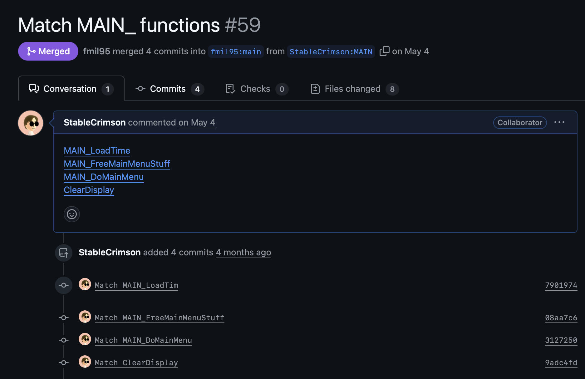

# Contributing

## Decompiling

### Picking a Function to Decompile

Once you have run `make setup`, any unmatched assembly will be stored in `asm\nonmatchings`, each file contains the assembly of one function.

To decompile, it's recommended to use [decomp.me](https://decomp.me), where there is already a profile set up for the project. First, search for the function name to see if a scratch has already been created. If not, create a new scratch, pick the **Legacy of Kain: Soul Reaver** preset, paste the assembly, and click **Create Scratch**.

### Function Signatures and Local Variables

When unpacking your backup of the game, you'll notice a `.SYM` file. This is the file containing the debug information for the game. This can be used with [PSX_MND_SYM](https://github.com/Gillou68310/psx_mnd_sym/tree/kain2) to generate a `decls.h`. This header file contains the function signatures, all local variables declared in them, their registers, and any inner scopes.

Ex:

```c
// path: C:\kain2\game\SAVEINFO.C
// address: 0x800B6840
// line start: 1353
// line end:   1386
void SAVE_SaveEverythingInMemory()
{ //line: 1
  // register: $s0
  // size: 0x29C
  register struct _Instance *instance;
  // register: $s1
  register long i;
  { //line: 9
    // register: $s1
    // size: 0x29C
    register struct _Instance *next;
    // register: $v0
    // size: 0x188
    register struct Level *level;
  } //line: 18
} //line: 34
```

This provides a huge amount of context for decompiling, do not deviate from the variables used in here unless you cannot get a function match otherwise.

## Styling Guides

### Indentation Style

This project uses Allman-style formatting. Statements or scopes that cannot be fit in one line should have their curly braces on their own lines.

```c
// Like this
if (a > 0)
{
  b->x = a;
  return a;
}

// This is fine, too
if (b == 1) { return b; }

// Not this
if (c & 5) {
  d->e &= ~c;
  d->f = 0x16;
}
```

### Label Extra Variables

Variables in the matched function that are *not* defined in `decls.h` should be marked with a comment.

```c
Message *Ptr;
int temp; // not from decls.h
```

### Label Extra Operations

Sometimes seemingly uneccesary operations are included in the code solely because they affect instruction ordering and help achieve a better match. If you need to do this to your function, it should be marked with a comment.

```c
do {} while (0); // garbage code for reordering
```

## Contributing a Matched Function

### Adding your Code

Now that the function is matched, find the `INCLUDE_ASM` call that is loading the assembly:

```c
INCLUDE_ASM("asm/nonmatchings/Game/CAMERA", CAMERA_SplineGetNearestPoint);
```

and replace this call with your decompiled function.

Next, run `make -j` to build. Warnings generated during this process such as implicit declarations or unused parameters should be addressed. If the build succeeds without any issues, then congrats! It's ready to contribute.

### Function Matches on Decomp but not When Building

If your function matches on decomp, but doesn't match after it's been added to the codebase, then surround it *and* the `INCLUDE_ASSEMBLY` call with `NON_MATCHING`:

```c
// Matches 100% on decomp.me but differs on this project
#ifndef NON_MATCHING
INCLUDE_ASM("asm/nonmatchings/Game/FX", FX_GetHealthColor);
#else
long FX_GetHealthColor(int currentHealth)
{
    STATIC long HealthColors[8924 + 6];
    long color;
    // ... rest of the function
}
#endif
```

### Contributing Your Match

For function contributions, each commit should contain one function match and whatever updates that were needed to make it build without warnings (like including header files).

Now it's time to PR. In the PR description, include links to the scratches for the matched functions:


